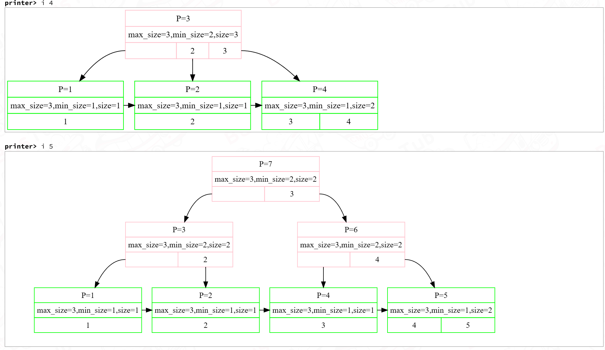
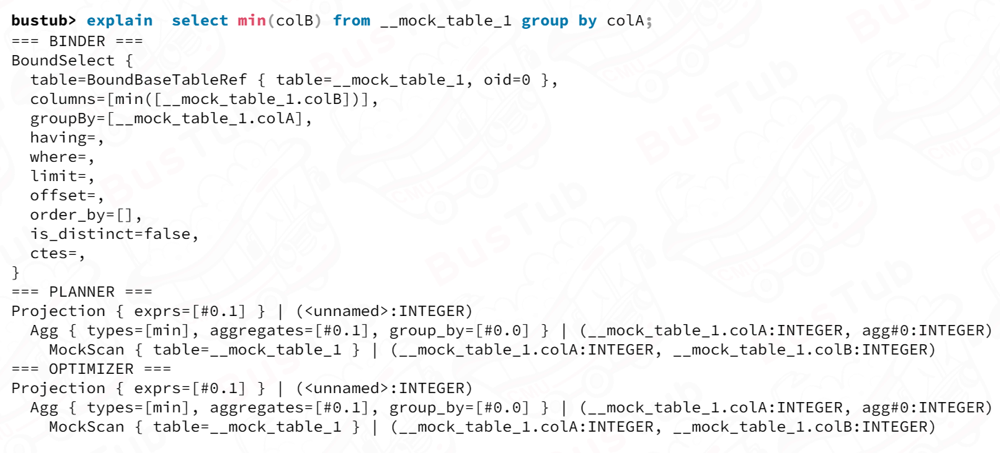
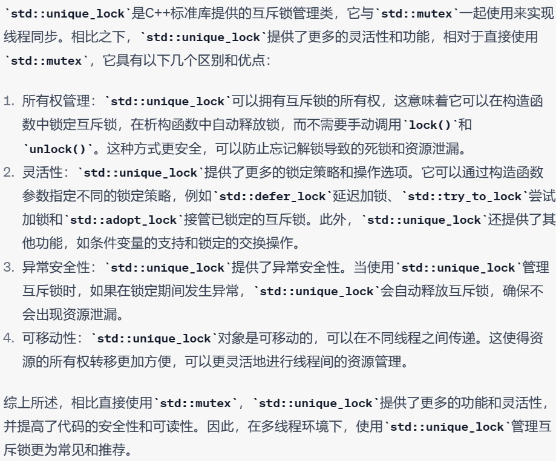

# CMU15445

## 环境配置

.cache的索引是由clangd构建的，如果删了可以按F1重新加载窗口，clangd会自己重新构建，cmake会生成compile.json文件，然后clangd根据这个构建出.cache，如果不使用cmake就必须先用bear make生成compile.json文件，然后clangd会自己根据这个生成.cache。

## lab0

1. cur_node->get()->InsertChildNode(c, std::move(std::make_unique<TrieNode>(c)));编译器提示我把std::move删除

2. 智能指针
   
   ```unique_ptr<int>
   unique_ptr<int> ptr;
   ptr.get()类型相当于int *
   unique_ptr<int> *point;
   point->get()类型相当于int *
   **point相当于int
   ```

3. dynamic_cast 可以将基类指针或引用转换为派生类指针或引用。如果转换失败，则返回空指针（或引用）或抛出 std::bad_cast 异常，因此 dynamic_cast 能够避免由于向下转换导致的类型不匹配等错误。

## lab1

1. task1实现一个可扩展的哈希表，根据给的key和value值插入到哈希表里，哈希表是一个dir_的数组然后每个目录项可以指向相同的哈希桶，难点主要在于当一个哈希桶满的时候要进行分裂（会分裂成两个哈希桶），分裂时要重新分配该桶里的所有key和value散列到两个桶里，然后dir_里的目录项重新指向这些桶。该task主要是维持一个映射关系。bucket里面存储索引关系key，value，其用list数据结构来存储。这里key和value其实是page_id和fid的映射关系。可以在buffer_pool_manager_instance.h这文件中看到。一开始只有一个桶然后慢慢分裂，这里采用的是动态哈希的可扩展哈希，例如，如果记录的数量是桶的数量的两倍，则可以使用比以前多两倍的桶来重建索引。但是，重建索引的缺点是，如果关系很大，可能需要很长时间，从而导致正常处理中断。已经提出了几个方案，允许以更渐进的方式增加桶的数量。这种方案被称为动态哈希技术;线性哈希技术和可扩展哈希技术就是这样的两种方案。参考[做个数据库：2022 CMU15-445 Project1 Buffer Pool Manager - 知乎 (zhihu.com)](https://zhuanlan.zhihu.com/p/571927310?utm_id=0)

2. 一个类的友元类里可以访问该类的私有成员，比如Page的友元类为BufferPoolManagerInstance，所以在BufferPoolManagerInstance类里可以访问Page的私有成员。

3. buffer pool其实可以认为就是在内存里常驻的磁盘缓冲区，磁盘上的编号为page_id，在缓冲区的编号为fid。具体空间为pages_，replacer_就是一个替换策略（只负责记录fid)，pages_加上replacer_相当于mit6.828里的bcache，但是不同之处在于bcache在缓冲区是没有编号的因为其是用链表存储缓冲区里的块的，所以查找时用bget遍历链表查看对应的磁盘块号，而buffer pool是用数组pages_管理缓冲区里的块，（有可能数组非常大）或者说bustub需要性能？所以还需要一个page_table_数据结构来维护page_id和fid的映射。数据库中为可扩展哈希表。

4. 那么数据库中的磁盘实际上是由disk_manager这个类维护的，这个类会在初始化时接收文件名参数，一般为test.db和test.log两个文件作为磁盘和日志，写磁盘操作其实就是写文件操作。

## lab2

### b+树的概念

lab1实现了一个磁盘在内存上的缓冲区，其中可以实现磁盘页编号page_id到内存的帧编号fid的映射以及替换策略，那么lab2的每个节点其实如下图，都是一个page的data部分，data部分就是LeafPage或者InternalPage或者BPlusTreePage，在这data部分里面存储了相应的真正索引的key和value等，这些存储在类里的array_数组里（如果某个类最后的变量是一个array_[1]，可以无限扩展这个数组），也称作柔性数组。这里用了很巧妙的trick，这里之所以声明成char类型4096大小的空间，而不使用各种类来落盘是因为各种类的大小都不一样，没法统一，而且最后要存的数据大小也无法确定。注意这里的data_数组为4096个字节即有可能是BPlusTreePage（包括叶子节点和中间节点）。TablePage和Page一样大。下面这图画错了，tablepage和page一样大。


下面的图是TablePage的data_部分


中间节点的key和value不一定是相等的比如下面这图里的P=6这个节点，key=4但value=5，所以中间节点的key记录的是叶子节点的最小key，value是该中间节点的子节点的page_id（子节点不一定是叶子节点，可能还是中间节点）。但是叶子节点的key和value值也是不一样的，key的含义是该叶子节点的page_id,而value比较复杂是rid类型，不仅有page_id，还有个slot_num槽，比如下图这些叶子节点的value可能page_id都是一样的（是key的高位），但是slot_num是依次递增的（就是key）。




这样看可能根本不知道key和value到底是啥意思，当做到lab3的时候就能了解一些，首先一个表可以对某一列建立索引（参考lab3关于index类的描述），那么这索引建立了之后怎么和b+树关联呢。这里在插入算子里当往表插入元素时，同时还需要插入对应的索引，遍历该表的索引，对每个索引这里用InsertEntry往索引里插入相应的tuple和rid，这时可以发现InsertEntry是Index类的虚函数，其实在BPlusTree类里把它重写了就是b+树的插入，那么就可以对应上了，插入的key其实是tuple的值（如tuple为{Values{13},Type::Int}，那么key就是13，别的地方的tuple可以有多组Values和类型，这里因为是索引只有一列。而插入的value就是insert算子执行器从子执行器穿来的rid。如果是执行简单的插入语句，子执行器其实就是Values执行器。

### 叶子节点的格式


### 中间节点的格式


### b+树的插入

1. 中间节点可以存储maxsize还不分裂，这时候再插入一个元素变成maxsize+1触发分裂条件。中间节点minsize应该取为（maxsize-1）/2+1因为第一个key是无效的。其实是统一的，中间节点分裂条件是maxsize+1，那么其最小就是（maxsize+1）/2。叶子节点的分裂条件是maxsize，那么其最小是maxsize/2。

2. 叶子节点只能存储maxsize-1，这时插入一个元素变成maxsize触发分裂条件。叶子节点的minsize应该取为maxsize/2。


1. 关于二分法，在叶子节点的Insert和中间节点FindKey都用到了二分，这里采用左闭右闭的写法，考虑最终结果取left和right即可，可以这样考虑，当循环结束时一定是left=right+1，比如Insert里，[1,3,5,6]插入2，那么当mid=1，a[mid]=3>2时，按理来说这时候right=mid才对，因为2是有可能插入到3的位置的，而不是right=mid-1，但是我们可以通过最终的结果来改变这种写法，我们先写right=mid-1，最后取left的位置，因为left=right+1，所以如果此处right=mid-1=0，但是最后结果是left=right+1=1所以是对的。

2. 插入的思想是先找到要插入的叶子节点，然后执行插入，插入完判断叶子节点是否溢出，如果溢出执行分裂，分裂时移动几乎一半的元素到新节点，然后将新分裂的节点插入到父节点中，插入到父节点时一样先执行插入，插入完判断中间节点是否溢出（父节点一定是中间节点），如果溢出再去分裂函数里执行中间节点的分裂，然后继续之后的过程。

### b+树的删除

1. 删除的思想和插入类似，先找到要删除的叶子节点，然后执行删除DeleteEntry，在删除中首先判断特殊情况，如果删除节点是根节点，且删除后只有一个子节点，那么让这个子节点成为根节点（因为中间节点不管怎样最小的size至少为2），而且这种情况是没有左右兄弟节点可以合并或者借的。如果删除节点不是根节点而且删除后该节点的大小已经小于最小size，那么取它的左右兄弟节点（这里的兄弟节点必须是同一个父节点），然后判断是执行借操作还是合并操作。判断的逻辑其实是比较简单的，由于不管是中间节点还是叶子结点，minsize=maxsize/2，只是中间节点的实际maxsize为maxsize+1，其minsize=(maxsize+1)/2。但代码中都写作maxsize（这里有点奇怪，我感觉中间节点应该是中间节点的maxsize+1），所以当本节点和兄弟节点的和如果小于maxsize说明可以在一个节点内放下执行合并，如果大于等于maxsize，说明另一个节点必然大于等于minsize+1，可以执行借操作。借和合并操作，参数都以左节点，右节点的形式传入，要借给谁用GetSize<minSize判断，借操作还需要更新父节点的key，合并操作里合并之后需要在父节点中删除被合并节点的key，value，这里很重要需要再次调用DeleteEntry。之后就循环之前的操作，直到没有节点被删除后再发生合并或借。

### 调试

1. 在测试文件中适当位置调用
   
   ```shortcode
   tree.Draw(bpm, "/home/zkz/bustub/test/storage/b_plus_tree_draw" + std::to_string(key) + ".dot");
   ```
   
   会在响应目录生成.dot文件。然后在终端执行
   
   ```shell
   dot -Tpng -O /home/zkz/bustub/test/storage/b_plus_tree_draw.dot
   ```

### 并发控制

1. 用issafe函数保证如果插入或者删除时如果会发生分裂，那么在FindLeaf中其父节点及所有祖先节点全部都会被锁住，所以在分裂后进行insertparent操作时不需要再给父节点上锁了。

2. 插入bug在中间节点插入索引为1时数组移动出错。

3. 删除bug在合并两节点时，删除兄弟节点为右节点时删除错了还是删除了原本节点，应该删除右节点的。borrow时中间节点的insert有问题，需要使用setkey方式。

## lab3

### bustub的启动

在tools/shell文件夹下可以找到shell.cpp文件

```
make -j16 shell
./bin/bustub-shell
执行后会执行shell.cpp文件
```

接着执行ExecuteSql函数会传入查询语句


函数中首先对几个特殊查询指令进行处理比如\\\dt,\\\di,\\\help之类

 

然后调用binder函数对对sql语句进行语法分析和词法分析生成语法树，在里面调用了libpg_query 库将 sql 语句 parse 为 AST。然后依次遍历`statement_nodes_`是一个存储SQL语句解析后生成的AST节点的指针数组，每个指针都指向一个解析后的语句节点。这个指针数组的元素数量就是解析后的语句数量。这里特殊处理了创建表，创建索引以及解释explain语句三种情况。

举个例子，如果我们有一个包含两条SQL语句的脚本文件，分别是创建名为"employees"的表和为该表创建一个名为"salary_index"的索引，那么解析这个脚本文件后，`statement_nodes_`就可能是一个包含两个指针的指针数组，分别指向两个解析后的语句节点。每个节点将包含有关该语句的信息，例如创建表语句将包含表的名称和列的信息，创建索引语句将包含索引名称和要索引的列的信息。这里一般只有一个语句然后里面是关于该语句各个节点的vector即binder.statement_nodes_


这里对于dynamic_cast的使用比较巧妙，在binder.BindStatement里根据stmt的类型转成了相应的子类指针， 但是返回时用父类指针指向。然后外部使用时先判断类型，然后根据类型再用dynamic_cast转成对应的子类，这时是一定能成功的，因为虽然是父类指针但实际指向的是子类空间，所以再转成子类时一定成功。

 然后执行planner把statement生成初步的查询计划（主要处理Select，Insert，Delete，Update语句,，大类分为上面四种，然后会在这四种里再细致生成seqscan，projection，agg，sort，limit等，plan会自底向上的生成各个子plan），然后把初步计划（最上层的计划，其子plan就是各个下面的计划）送入优化器进行优化，优化流程是依次执行下面这些优化，优化其实就是在根据某一特定组合比如当前是limit查询计划，且其子计划为sort查询计划，那么生成TopN查询计划为其指定scheme和一些必要的参数比如（分组，limit的数量）。或者是如果连接表是查询的表中含有index就用index_seq查询对其优化，当然这些优化器也需要新的执行器来执行，说白了，优化器就是新的plan，每种plan都需要executor去执行。

最后调用执行器执行优化结果。


执行器会递归的创建对应类型的执行器，直到没有子查询计划为止。


这里举个执行器的例子，比如values执行器，一开始从plan_里拿到的values是二维的即vector<vector...>因为匹配的元组可能有很多行，每行又有很多列，例如第一行记录的元组为`(1, "Alice", 23)`，第二行记录的元组为`(2, "Bob", 27)`，依此类推。这里，每个元组包含三个数据值，分别对应着`id`、`name`和`age`属性的值。然后声明的values用于保存每行。


### TablePage

TablePage的格式如下，其由于没有成员变量所以和Page一样大小。下图只是TablePage的data_部分。


在TablePage::InsertTuple中，SetFreeSpacePointer把free space pointer往前面调了即将插入的tuple的size，给要插入的tuple预留空间，然后把tuple的数据考到这个地方。

SetTupleOffsetAtSlot把前面找到的空闲的slot的偏移内容置为指向tuple所在位置的指针即GetFreeSpacePointer，然后把slot的size内容置为tuple的size。其实一个slot就是上图的Tuple_1 offset加上 Tuple_1 size总共8个字节，因为偏移和大小都是用uint32存的，所以总共64位8个字节。


### 必要类的介绍

+ schema到底是个什么玩意：schema其实是column类的数组，而column类包括列名和列的类型。一个执行器应该对应一个schema，注意一张表也有一个schema，这两个是有区别的，执行器的schema是Next输出的tuple的列名和类型，而表的是表本身的列名和类型。比如insert执行器的schema就是用explain关键词可以看到即__bustub_internal.insert_rows:INTEGER。


+ value表示一个值（int，char等），用一个Value vector和一个schema可以构建一个tuple。一个tuple相当于表里的一行，一个value相当于这一行的某一列元素的值和类型，这一行所有的列名存储在schema里。

+ index里的const std::vector<uint32_t> key_attrs_含义，可以参考


+ Index类里有IndexMetadata，IndexMetadata类如下


这里name就是t2v3,table_name_是t2，key_attrs_是0，key_schema是{{'name'},{Type::Int}}。


### 实验需要注意的坑

1. seq算子如果把iter_用编译器默认构造函数会出问题，因为默认构造函数对指针的成员变量根本没有分配空间，而此处重载时会直接对指针解引用发生错误。#0.0是子执行器表的第一列。


1. index_seq注意构造器的本身构造函数是比init先执行的，一些必要操作得放在构造函数中而不是init，比如tree_的初始化。这个遍历利用了b+树的迭代器遍历。

2. insert_executor是先在table中插入后在table_indexes中的所有索引都添加新的tuple，这个插入会调用b+树的插入。

3. index_seq在遍历后插入一直死锁，发现原因当根节点为叶子节点时（只有一个节点）这时迭代器end用LockRootPageId上锁后没有用TryUnlockRootPageId解锁导致的。

4. agg算子的plan生成，在plan_aggregation.cpp


算子的.h文件下面这两个含义比较难理解，首先plan_->GetGroupBys应该是v3，然后keys里的就是tuple这一行中为v3的那一列，plan_->GetAggregates应该是[v1,v2,v4,v5]，比如tuple有v1，v2，v3，v4，v5这5列假设值分别是1，2，3，4，5。这时候group_bys为v3，那么keys=[3],vals=[1,2,4,5]。


这里可能很难理解下面这个result和input的含义，result是unordered_map即ht_[agg_key]其实就是上面的ht_[agg_key]，用于存放这个group聚类的各个agg算子比如（max，count等）的结果，input就是上面的vals即整个表的[v1,v2,v4,v5]。下面就是计算聚合后各个agg算子的值。


这里举个实例原表如下


执行select avg(score),max(score),min(score) from student group by subject现在以subject为group，即plan_->GetGroupBys为[subject]，然后plan_->GetAggregates为[score,score,score]（因为三个agg算子都只涉及score列），plan_->GetAggregateTypes()即agg_types=[avg,max,min]那么如果现在传入的tuple为第一行keys=[Math]，vals=[80,80,80]。所以CombineAggregateValues会对ht_[Math]的结果进行更新。如果Math已经有了那么就继续在上面更新，比如第二行也是Math那么ht_[Math]的结果就是第一行Math的结果再累加新的三个avg，max，min的结果。(这里可以看到AggregateKey类里已经对==重载过了所以才能判断ht_[Math]是不是已经存在过)


下面是plan_aggregation.cpp的部分代码，group_by_的例子比如是colA+colB，PlanExpression的作用是将表达式转换为树状结构，比如这里根节点就是+，子节点分别是colA和colB，group_by_exprs里就变成[colA colB]，而这就是plan_->GetGroupBys


下面是aggregation_executor.h的部分代码，这里虽然plan_->GetAggregates是抽象类的智能指针的vector即expr其实是指向抽象类的智能指针，然后调用了该类的Evalute，这个函数在抽象类中是纯虚函数，C++中纯虚函数和纯虚类是不能被调用和实例化的，所以其实这plan_->GetAggregates的抽象类的智能指针的vector里的指针元素其实真正指向的都是其派生类，所以下面调用的Evaluate也是派生类里重载的虚函数。


agg算子的plan如下group by的列可以不出现在前面的select里，这样planner会多生成一步Projection，agg算子的next提交的tuple的schema参考plan里的部分，其实就是先group_bys再填充需要的算子结果。如下




4. 像下面这种指令可以从NestedLoopJoin开始进行调试，group_by为空（agg_key为空），又因为没有连接条件所有predicate永远为true，左表的tuple和右表的tuple是无条件连接。aggregates其实是agg_val由于这里是count(*)，所以是恒为1。看一下代码理解的很快的。
   
   

5. 每次调用child_next后下次进入当前执行器的next再调用child_next会在上一次调用的结果后继续执行（因为最底层seq_scan其实是迭代器每次不会被重置）。

6. 解题思路主要看explain语句解释，输出的tuple以及perdicate等谓词的含义都有。

7. 当有index索引时，orderby直接变成index_seq，没有索引时需要实现sort算子。sort算子里的排序匿名函数排序可以参考一下


   4. 实现topN迭代器使用priority_queue，这个与sort刚好相反

```
//对于基础类型 默认是大顶堆
 priority_queue<int> a; 
//等同于 priority_queue<int, vector<int>, less<int> > a;
```

因为less当第一个元素小于第二个元素时返回true，那么就是第一个元素优先级比第二个元素低，而C++中优先队列的底层数据结构为堆，那么优先级高的元素会被放在堆顶，所以取top时取到的是优先级高的元素即大的元素。其实就是符合要求的元素全在堆底，这种情况下要拿到满足要求的其实要取堆底的元素，但是我们可以限制要取得元素数量让这个堆达到这个数量后如果来新的元素先加入然后再弹出。

5. 全部实现后发现当执行以下命令时

```
create table t1(v1 int, v2 int);
insert into t1 values (1, 50), (2, 40), (4, 20), (5, 10), (3, 30);
create index t1v1 on t1(v1);
create index t1v2 on t1(v2);
select * from t1 order by v2;
insert into t1 values (6, 0), (7, -10);
```

最后的insert会卡住(delete也一样)，因此排除insert和delete问题，发现

```
IndexScanExecutor::IndexScanExecutor(ExecutorContext *exec_ctx, const IndexScanPlanNode *plan)
    : AbstractExecutor(exec_ctx),
      plan_{plan},
      index_info_{this->exec_ctx_->GetCatalog()->GetIndex(plan_->index_oid_)},
      table_info_{this->exec_ctx_->GetCatalog()->GetTable(index_info_->table_name_)},
      tree_{dynamic_cast<BPlusTreeIndexForOneIntegerColumn *>(index_info_->index_.get())},
      index_iter_{tree_->GetBeginIterator()} {}

void IndexScanExecutor::Init() {
  index_iter_ = tree_->GetBeginIterator();
}
```

猜测应该是在**IndexScanExecutor**类的构造函数和init中连续两次调用**GetBeginIterator()**

函数，即连续对同一叶节点上了两个读锁，但是在索引遍历完成只会解除一把读锁。后来的插入和删除操作均需要对该叶节点上写锁所以会发生死锁。(PS：那么我为什么会在init中又初始化一遍是因为第11个测试需要连续两次进行索引查询，所以第二次时迭代器应该被置为初始值，否则查询结果不完整。)

## lab4

### 实现lock_manager

#### 上锁基本流程

1. 判断事务隔离性和锁模式是否匹配（参考[数据库并发控制原理 – 沧海月明 (inlighting.org)](https://www.inlighting.org/archives/database-concurrency-control)
   
   

2. 拿到表的请求队列锁

3. 检查队列是否这次请求为一次锁升级
+ 是否已存在同样的锁请求(如果没有说明这次为一次锁升级)

+ 是否有别的事务同时在进行锁升级

+ 是否锁升级匹配
4. 进行锁升级前先释放原来级别的表锁并删除相应的锁表的记录，并在队列里删除曾经授予的记录。

5. 将这次锁升级作为新的请求插入队列末尾中（这里不保证已经授予的锁在前面未授予的在后面)，因为只要有请求我就插在队列尾部，比如如果冲突了无法授予那么这个为一个锁等待，但后面那个锁如果为一个锁升级被授予。

6. 检查升级请求
+ 先获取队列锁通过lock变量（构造函数第二个参数意味着假定当前线程已经拥有了队列锁，不会再次尝试加锁，函数结束时lock作为临时变量会调用析构函数自动释放锁）



+ 判断当前锁请求与之前已经赋予的锁是否冲突（即是否可以加锁）这里很有细节，GrantLock里面得先判断当前请求与之前已经授予的是否冲突，如果不冲突，还得考虑锁授予队列的优先级，如果是锁升级那么它优先级就是最高的，如果不是，则还需要考虑之前在等待的锁是否与当前锁兼容，这样可以防止锁饥饿（参考[CMU15-445 Project4 Concurrency Control | Eleven's Blog](https://blog.eleven.wiki/posts/cmu15-445-project4-concurrency-control/)

比如...->S（被授予）-> SIX（未授予）->S（未授予）。这种情况下尽管未授予的S锁与之前的锁不冲突，但是SIX是先来的，S锁与SIX冲突，优先级并不是最高的。如果未授予的S锁是锁升级则不考虑这个问题，那么其优先级就是最高的。

+ 如果不可以授予则释放lock，并使得线程进入等待状态

+ 如果等待到了lock（被唤醒后得线程仍在wait函数中会尝试获取lock），但事务处于aborted那么主动放弃lock并唤醒别的事务来竞争lock

+ 如果可以授予则赋予锁

#### 测试文件解读

+ 首先所有的事务也是有一个manager来管理的，这里是transaction_manager，还管理事务的日志之类的。每次生成新事务时调用管理器里的begin来生成新事务，新事务默认都是REPEATABLE_READ隔离级别，初始状态为growing，然后加锁正常加，但注意解锁如果找到了加锁记录得先把事务状态设置为收缩态然后进行解锁。这些操作是lock_manager实现的。

+ 死锁文件的测试，是用两个线程，第一个线程先对表上意向锁，然后对第一行上锁，然后休眠一下（保证第二个线程对表上锁和对第二行上锁都完成），再对第二行上锁；第二个线程先对表上意向锁，然后对第二行上锁然后对第一行上锁。这时候其实两个线程就死锁了，然后程序休息足够长时间，以此来运行死锁检测打破死锁（通过检查事务一是否被置为ABORTED状态来判断）。死锁检测其实在lockmanager被创建时就是一个独立线程不断运行
  
  

### 实现dead_lock_detection

+ table_lock_map_和row_lock_map_相当于关于某个表或者某个行的请求队列的管理，这队列里既存在已经被授予的请求，也存在在等待的请求或者在升级的请求。这是由lock_manager统一管理的

+ 事务管理自身的表锁和行锁可能只是一个表中和当前这个事务有关的锁，并不是这个表里所有的锁都在，所以i相当于一个局部的管理，由7个队列管理（5个表锁，2个行锁），为什么有了全局的lock_manager管理关于某个表或者某个行的锁之外还需要这种事务管理自身的呢，因为当事务Aborted时候需要释放和事务自身有关的所有锁并在全局的lock_manager删除授予记录。

+ 判断是否能给当前锁授予，需要在全局的管理中定位到该表或者该行的锁队列，判断是否兼容。

+ txn_table_map_和txn_row_map_相当于管理某个事务在等待某一个表或者某一行的表和行的编号（没被授予的）。

+ 一个事务可以请求多个资源比如可能请求表1的锁被授予了，但请求行1的锁还没被授予。

+ 为什么需要意向锁，因为意向锁就是为了防止锁管理器再去遍历要表的所有行都没有加锁。如果锁管理器想给某个表上个表锁，那么它还得先去检查底下的每一行是否被加上了与这个表锁冲突的行锁，这是很耗时间的，如果有意向锁它一下就能判断是否可以加上这个表锁。

+ 总体思路比较简单，就是先构建有向图，根据表和行的请求队列把同一资源发生冲突的事务构建为一条边。然后运行有向图的检测是否存在环路算法，这里通过DFS实现。如果检测到了环，则将环中最大的txn_id事务设为Aborted，接着很重要，需要唤醒这个等待的事务，让它把自己的请求删除了，并且唤醒其他在等待他手上的资源的事务（这里其实别的事务还是拿不到，因为事务已经分配锁的请求没被删除，被删除的请求只是该事务自己等待锁的请求）。这里注意一下事务的Abort是由Transaction_manager执行（我只能设置事务的状态为Abort），那么事务的Abort会执行什么事情呢，首先会进行回滚操作，回滚后会进行释放锁操作，这里就很神奇，释放表锁和释放行锁会调用lock_manager的UnlockTable和UnlockRow会删除原来记录各个资源的队列里的授予锁的记录，相当于这里资源才被释放，被释放后会通知在该资源上等待的事务，这样死锁就接触了。（可以参考我在ipad上写的两页test的执行过程）

### Task #3 - Concurrent Query Execution

+ 在算子里加锁由于只有seq以及insert和delete是直接和表数据交接的，别的算子都是在此基础上间接获得tuple的，所以只需要对上面三个算子加锁。
  
  

+ 插入算子这里说的无需手动释放是事务在Abort或者Commit时用transaction_manager管理最后会把所有的表锁和行锁释放（这才符合2PL的定义），所以即使插入结束也不能立马释放写锁。这里是在插入该行后才对这行上写锁。
  
  

+ 数据库隔离级别设置为 READ_UNCOMMITTED，则事务可以读取尚未提交的数据，这意味着事务可能会读取到其他事务正在修改的数据，因此在这个隔离级别下不需要加锁。

+ 在 REPEATABLE_READ 隔离级别下，事务在执行期间会锁定它所读取的所有数据，以确保其他事务不能修改或删除这些数据，从而避免了脏读、不可重复读和幻读等问题。直到事务被终止或者提交，自动释放锁。

+ 在 READ_COMMITTED 隔离级别下，事务只锁定它所读取的数据行，并在读取完毕后立即释放锁定，以允许其他事务访问这些数据。

+ 在 REPEATABLE READ 隔离级别下，事务在执行期间可以多次读取同一数据，即使其他事务对该数据进行了修改也不会被读取到，是通过多版本并发控制（MVCC）机制来实现的。
  
  在 MVCC 中，每个事务读取的数据行都会分配一个唯一的事务 ID（称为版本号）。每次数据行被更新时，都会创建一个新版本的数据行，其事务 ID 会更新为新的版本号，并保存在存储引擎中。
  
  当一个事务读取一个数据行时，存储引擎会检查该事务的隔离级别，并返回该事务版本号之前或等于该事务版本号的数据行版本。因此，即使其他事务对该数据行进行了修改，该事务读取的仍然是之前的版本号对应的数据，从而实现了 REPEATABLE READ 隔离级别下的可重复读。
  
  需要注意的是，在 MVCC 中，每个版本的数据行都需要占用存储空间，因此可能会占用较大的存储空间。同时，由于每个事务读取的数据版本可能不同，因此在执行复杂的查询操作时，可能需要执行多次查询才能得到一致的结果，从而影响性能。

## 语法

+ 关于dynamic_cast和reinterpret_cast，在b+树实验中，由于我取到的page里的data是char*类型，那么我在FindLeafPage里不知道它是啥类，那我只能先转成父类，然后再判断类型，再把父类用reinterpret_cast强制转成子类。
+ static_cast可以把父类转成子类，TablePage是Page的子类


## 问题

+ 父类与子类转换，TrieNodeWithValue是TrieNode的子类


这里先构造了一个子类空间然后用指针指向它，但是执行插入时插入的形参是父类，这没关系，因为子类是可以向上转型成父类的


编译器会通过指针去找到那片地址然后发现它真正指向的是子类空间。

+ 如果一个父类有很多子类，应该根据类型用工厂模式，生成各种子类的空间，然后用个父类指针指向返回，后续用这个父类指针作为参数传递，需要用到某个子类的时候再使用dynamic_cast转成那个子类即可。

+ static_cast在把父类指针（指向的父类空间）转成子类指针时和repinter_cast的效果是一样的。子类转成父类是安全的，用什么转都可以。

+ 容器初始化可以按如下方式生成一个临时的std::vector<colunmn>的变量，其中只有一个元素。


+ 可以一次实例化多个类如下Page是类名


+ 如果前面声明了一个非const变量，但是下面有个函数传参必须为const，那么可以把这函数再包装一层传入指针。如下面如果有个变量Tuple tuple,如果直接传&tuple到EvaluateJoin会报错，但是给这函数再包一层Matched这样就可以传了。


+ 在topn算子由于要取到前十个大小的元素，采用了优先队列，优先队列需要三个参数，第三个参数是类型。
- `_Tp`：表示优先队列中存储的元素类型。
- `_Sequence`：表示底层容器的类型，默认为`vector<_Tp>`。
- `_Compare`：表示元素比较的函数对象类型，默认为`less<typename _Sequence::value_type>`。


_Compare是函数对象类型，_Sequence()其实是调用了底层容器的构造函数即vector<_Tp>的构造函数返回一个空的容器。


我用下面这种写法其实调用了优先队列的构造函数所以需要传入cmp参数。（cmp是我定义的一个匿名比较函数。返回类型为bool）


（PS：decltype(cmp)其实就是bool类型，那为啥我不可以写成


这错了，decltype(cmp)其实是函数对象类型并不是bool类型）


+ topn优化器有一个bug，最后一行如果写return plan则会出问题识别不到topn。optimized_plan是已经把子节点优化后的plan，注意优化时是先堆子节点进行当前的优化方法，最后才对根节点plan进行当前方法优化。


这里还有个trick，optimized_plan其实是unique_ptr,但是函数的返回类型是shared_ptr，是可以这样返回的，但是如果要把shared_ptr指向一个unique_ptr得用std::move(unique_ptr)。

+ make_unique只能调用类的构造函数来构造智能指针，要让智能指针指向某个地址得用ptr.reset(&a);
+ 智能指针也可以通过引用传递，unique_ptr禁止复制和共享指针


结论就是智能指针作为形参传递时直接用引用就好了

+ 右值引用到底是啥，左值引用其实就是一个指针指向原来地址，那右值引用也一样吗，而且为啥可以&右值。

+ 多个事务对同一个表上了表锁，但多个事务对某一行都有锁，想解锁表锁时只要保证该事务对该表的行锁都解除了就可以吗？别的事务还有行锁怎么办？

+ 报下这个错时只要在行尾加个回车就行
  
  

## 项目问题

+ 如果页的大小为16kb，而磁盘只保证4kb读写是原子的，刷脏页的时候只刷了部分页进程就崩溃了怎么处理？
