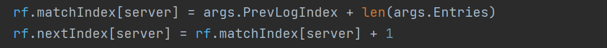

# MIT6.824

## lab1

### 思路

 总体思路就是需要在master设计一个Do函数，让worker经常去call这个函数，等于是去向master要任务，要到任务后worker里根据master的回答，map类型的任务和reduce类型的任务分别处理，做完了之后分别call master的mapdone和reducedone。当然肯定要所有的map都做完才能够开始reduce任务，master分配任务，worker管做任务以及做完了向master要。worker做任务里如果对于map任务就把文件都进来然后变成键值对写到临时文件里（这里用临时文件是因为这个map后面可能会死掉，这些文件都是无用的），当worker把map做完去调用master里的mapdone时，master才会把这些临时文件改名字变成中间文件。worker做reduce任务时，会收到master给的这个reduce号的中间文件，这作为reply的参数，然后worker对这些中间文件进行解码成键值对，然后对键值对进行排序将结果写入这个reduce编号的输出文件。master的结构里维护着所有map和reduce任务的队列。注意map的数量是初始的文件数量，reduce的数量是初始给的，键值对要hash后mod这个数量放到相应的中间文件里，而worker并行的数量不重要，因为反正worker做完任务后可以再要。

### Bug

+ wc正确性测试没过，因为reduce里的对一个reduce的文件for循环写错了位置，还有就是当map的数量为8时(总共8个文件)超出文件索引时会打开上一次的文件，因为reply没有初始化，又沿用了上一次的。

+ 各种测试都出现connection failed，或者unexpected EOF，因为master先退出了，这时候worker还没退出，只要在Do里添加检测master的状态为Done时退出申请任务，而不是通过反馈的reply里的参数来判断，这样会更好一点。（因为有可能master结束了没人应答）

+ crash和jobcount没通过，因为检测map和reduce是否存活时忘记考虑当map和reduce为done时是不需要检测这些的，还有就是当超出索引时分配之前死掉的map和reduce工作时需要把计数器重置一下，不然马上又会被检测出认为死掉。最后一个bug是将任务重新分配给新的map和reduce，忘记把分配后的任务状态置为DOING。这也导致jobcount改了上面第二点里的bug后还是出现了连接失败，就是因为有worker超时了，分配后忘记改状态。

+ 可以考虑worker死掉后重新搞个map或者reduce去做他的任务，而不是在原来的数组里修改其状态重新开始，因为需要把原来的map和reduce任务杀死。

## lab2

### lab2A

#### 思路

+ 在ticker中每隔心跳时间leader发送心跳，如果当前服务器选举超时，则主动发起选举，这里比较重要的是如何控制一个服务器在一个任期内只能投票一次，我采用的办法是在当前任期内如果投票成功了，votedFor先保留不要置为-1，当任期改变了再置为-1，这样如果同样的任期又有人叫它投票会发现votedFor既不是-1，也不是候选者的id，就不会再投票了。由于测试的时候有各种情况，比如投票的时候，发现自己的任期居然比候选人的任期还高，那么拒绝投票，如果自己任期比候选人小，自己得变成follower，任期变为参数任期，并且有投票权（置为-1），因为有可能这时候自己是leader，如果角色不变得话有可能一开始产生两个leader。收到心跳的时候也要注意，如果自己比leader的任期还大，返回自己任期，这时候leader收到返回的任期要把自己变成follower。

+ 收到投票判断任期，如果自己任期大，则拒绝投票并返回自己任期让返回自己任期让leader变成follower，投票权变为-1，任期变为返回的任期；如果自己任期小，先把自己变成follower，然后投票权变成-1，把任期变为候选者的任期（如果任期相等就没这些操作）然后进行后续的投票判断。注意如果拒绝投票投票权不要变成-1。

+ 收到心跳判断任期，如果自己任期大，则返回自己任期让leader变成follower，投票权变为-1，任期变为返回的任期；如果自己任期小，则自己变成follower，投票权变为-1，任期变为参数的任期（如果任期相等就没这些操作）然后重置选举时间，状态变为follower，开始比对日志，如果日志不匹配主要采用下面的逻辑
  
  
  
  如果日志匹配开始添加日志，从上一次匹配成功的后面一个位置开始比对如果任期相等则认为日志匹配，如果任期不等则开始截断然后把新的entries添加上去即可。最后还要判断一下要不要提交日志。

#### bug

+ 有一个bug就是在一个任期内有两个leader，说明有人会投两次票。比如说总共就三个服务器，有个服务器成为leader了，结果另一个也变成leader。
  
  解决方法是在投票环节加个判断，如果参数任期比我的任期大，那么我就自动变成follower，任期变为参数任期，并且有投票权（置为-1）。

+ 千万注意计时器的重置情况只有三种：收到心跳且自己任期小于或等于leader发来的任期；为别人投票并且已经投票成功；超时的时候开始选举

+ 如果拒绝投票不要更改投票为-1

+ 投票对象不能随意变更，只有三种情况：当自己任期发生改变时才变更为-1；自己发起选举变为投票自己；成功投票给候选者

### lab2B && lab2C

#### lab2B思路

+ 添加选举限制必须日志比自己新的人才可以当选leader，在日志匹配成功后添加leader的日志。

#### lab2C思路

+ 只要实现persisit和readpersisit，并对nextIndex进行优化。

#### bug

+ 解决TestFailAgree2B的bug是因为follower提交的应该是lastapplied而不是commitIndex

+ 解决TestBackup2B的bug其实和上面一样的，leader提交的应该是
  
  lastapplied而不是commitIndex。因为可能commitIndex已经很大了但中间的还没来得及提交。

+ 之前忘记看了leader只能提交自己任期的日志，如果提交别的任期日志可能会造成已经提交的日志被修改。改完这个后会lab2B的TestBackup2B出现log map和server map不匹配，既两个服务器在相同的索引提交了不同的日志内容，出现这种情况之前会看到一个leader一直被调用start添加内容一模一样的日志，但是各个服务器均日志匹配失败一直没添上日志。最终其实本质原因就是各个服务器的nextIndex有问题，但这还要分追加日志成功和追加日志失败的两种情况，其实大概率是因为追加日志失败，最后发现是心跳当匹配失败时返回的XTerm有问题，下面这里的XTerm之前写成了args.PrevLogTerm（其实服务器跟本没有这么大任期的日志）。然后返回给服务器进行查找XTerm任期的最后一条日志就有问题，这个nextIndex[server]也跟着有问题。
  
  
  
  （怎么找的bug，首先在这个测试里每个部分打上log，然后在raft.go里打log看提交的日志这些啦，为什么leader添加了日志但是服务器的心跳里却没添加，在心跳里打log看为什么日志没匹配成功最后发现nextIndex有问题，然后发现XTerm有问题。）
  
  

+ 解决了上面2B这个bug本来以为2C会直接通过，但是Figure8（不可靠）居然出现nextIndex超出索引导致prevlog越界，看一下本来是这么写的
  
  
  
  打log发现这里nextIndex越界了好多，猜测有可能是nextIndex中途被别的leader修改了，采用下面这种写法解决问题
  
  

+ 出现apply error可能是因为matchIndex或者rf.nextIndex有问题
  
  

### lab2D

#### lab2D思路

+ 首先要先引进lastIncludedIndex和lastIncludedTerm两个量，所有的log索引都要跟着修改，用getLogIndex和getLogTerm两个API代替原来的索引否则会发生溢出或者索引为负值。然后完成snapshot函数，这个函数其实就是如果当前server提交了十次则上层会调用它生成快照，会传入index和快照的data，那么我只要把log保留到index之后的部分即可，同时还要持久化快照信息（data）和lastIncludedIndex以及lastIncludedTerm。然后当leader要发送给其他server日志这时候可能会出现要发送的日志已经被leader丢弃了变成快照了（虽然leader生成快照的前提是leader必然已经提交了这些日志，但这只能保证超过半数以上的节点有这些日志）。这种情况下leader就需要把快照直接发送给server，代码里用sendInstallSnapshot和InstallSnapshot两个函数实现，server接受到后先把自己的日志在快照前的全部丢弃，保留之后的日志，然后将快照提交（这种提交与之前的日志提交是等效的，不过一次提交了多条日志而已）。然后持久化。其实InstallSnapshot就相当于Appendentries，只不过是在leader没有server需要发送的日志情况下而已，所以sendInstallSnapshot就和sendAppendentries一样要根据返回值进行相应的一些身份准换和处理。

## lab3

### lab3A

#### 思路

+ 主流程：client发送请求->kvserver收到请求进行去重->kvserver向自己的raft调用start发送命令(只有leader才可以进行处理)->leader的raft开始同步所有raft->超过半数的·raft都同步了这个命令->leader的raft开始提交这个命令紧接着已经同步的raft也提交命令
  
  ->同步的raft都上报自己的kvserver命令已提交->kvserver从applyCh（这是与raft层通信的通道）得到提交的命令->kvserver把这个命令应用到自己的数据库里->作为leader的raft生成回复响应client

+ 首先要明确有多个client，同时有多个kvserver，多个client都可以对某个kvserver发出Get/Put/Append请求，处理流程大致是client发出请求该请求带有clientId和commandId(这个Id是可重复的因为每个client的command都是从0开始计数，每发一个请求就在该client之前记录的基础上加1)这里可能会有疑问首先包括clientId没啥好问的因为有多个client嘛，但为啥不用一个全局的commandId呢，其实因为client之间是不能直接通信的所以并不知道全局的Id递增为啥了，某个client能通过RPC调用kvserver层的所有kvserver。请求作为kvserver的对应Get/PutAppend函数的参数，client直接调用作为leader的kvserver的相应函数Get/PutAppend，然后client在收到reply后要根据情况处理，比如kvserver会回复ErrWrongLeader或者ErrTimeOut（虽然client会记录上一次发送成功的leaderId，但是leader可能会发生变化），当出现这些情况就换一个kvserver的Id重试发送。当然这时候会出现一个问题，比如reply错误或者直接丢失了我并不知道kvserver到底应用了这个请求没有（作为leader的kvserver只能应用某个请求一次），所以在kvserver端需要处理重复请求的问题（kvserver端会记录之前应用的最大的commandId以及其内容来对比，如果是之前已经应用过的请求，则直接返回之前的返回内容）。

+ 现在来介绍一下kvserver端要怎么实现，首先每个kvserver其实就是包含了之前的raft，那么在作为leader的kvserver收到client发的请求后需要先进行去重，这是通过记录client编号以及之前应用的最大commandId实现，所以需要一个map来存即为clientMaxSeq，为了后面返回结果方便我们直接把整个命令都存下来。发来的请求就有clientId和commandId只要与map里的相比较如果小于或等于说明之前已经应用过了，返回之前的值就行。如果是新的请求然后开始往下调用自己的raft层的start开始同步。但是kvserver肯定得需要一个线程来等待raft层全部同步了然后提交命令，所以就是applier这在kvserver生成得时候就自己一直检测applyCh就行了，因为raft层如果提交了也是交到这个通道。如果查到raft层提交了既完成同步了，要进行应用这个命令了既applyCommand函数，为了保险再判断一下之前有没应用过这个命令，然后根据log内容（raft层提交的其实就是添加了一些信息的log，所以log的command会定义成接口就是为了这边好改变数据格式变成Op类型方便数据库应用）进行应用修改数据库DB这是一个map来记录键值对的。应用完之后还需要告诉发来的client我搞完了，这也是个难点，首先一个kvserver是会收到多个client发来的多个请求的，虽然applier线程是kvserver自己的，但是可能之前的请求应用完时kvserver已经收到了很大新的请求，这是并发的，所以每个kvserver还需要一个唯一表示请求的通道来专门等待，那么显然就是调用start后返回的index，所以kvserver里还有一个replyChMap，键就是index标志唯一的请求（commandId不是唯一的），值就是准备返回给client的结果。那么这个通道在什么时候就该创建 ，在Get/PutAppend里的start调用完后就直接开始等待通道结果就行。
  
  

+ 区分一下commandId和commandIndex，commandId不是唯一的，每个client都有自己一套从0计数的，但commandIndex是raft层返回的是唯一的一个全局递增的日志索引（因为所有人的日志都是同步的），index在调用start后可以马上得到不需要登全部同步完了才知道。

+ 多次测试
  
  

+ 怎么保持线性一致性？
  
  

#### bug

+ 一开始get一直乌发完成，检查后发现是忘记把"Get"作为操作数传入参数

+ 先出现直接key0都错了
  
  
  
  怀疑是去重的地方出了问题，其实是ok里面把commandIndex和command.CommandId给混淆了修改后如下
  
  
  
  下面这记录每个client的之前最大Id也要改成如下
  
  

+ 碰到超时bug
  
  
  
  查阅资料说是start后没有马上开始发送日志同步

### lab3B

#### 思路

+ 因为raft层的日志虽然有生成快照的函数但没有人调用，这里就是当应用完命令然后kvserver的raft层状态会随之改变，当raft层的状态数量超过了给定的最大状态数量那么就生成快照，然后当kvserver重启的时候读入快照，以及在applier等待raft层提交时当raft层提交的是日志快照的时候，读入日志快照，这种情况下就不需要应用请求了，因为kvserver的快照就是状态等于应用请求后的结果。当然这里还需要判断一下如果raft提交的是旧的快照则不能读入。所以kvserver还需要得到自己已经应用的请求的index
  
  

### bug

+ 

+ 出现
  
  
  
  是因为把旧的日志快照应用了导致状态错误。
