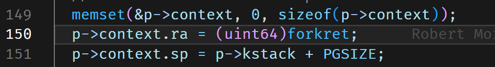
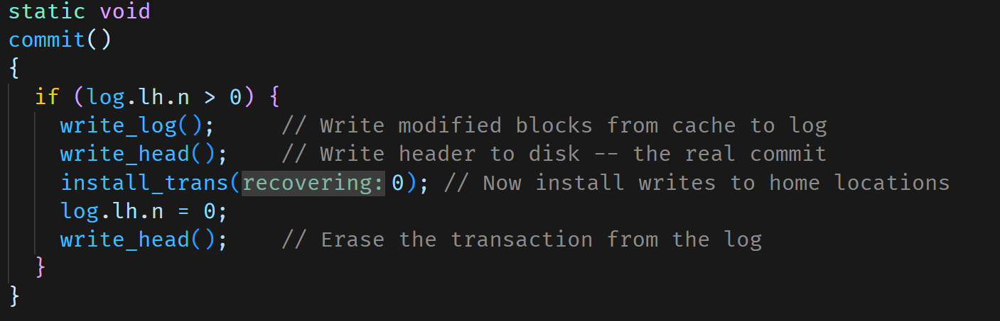

# mit 6.828

## 环境配置

+ 打开发现一直乱报错，检查了原来是索引没有构建，即compile_commands.json一直为空，那么用bear生成索引用法为

```
make clean
bear make
```

如果成功了会发现生成了一个.cache文件夹 

+ 配置.vscode参考博客[优雅的调试—在vscode上完美调试xv6（完结） (sanbuphy.github.io)](https://sanbuphy.github.io/p/%E4%BC%98%E9%9B%85%E7%9A%84%E8%B0%83%E8%AF%95%E5%9C%A8vscode%E4%B8%8A%E5%AE%8C%E7%BE%8E%E8%B0%83%E8%AF%95xv6%E5%AE%8C%E7%BB%93/) 

## gdb调试问题

+ 我发现如果对文件打断点如果打在系统调用的函数上会在奇怪的地方，要以汇编指令的地址打才可以。比如在C指令级别我现在打到sh.c的write调用函数


解决了原来是没有命中这个函数断点

## RISCV启动

+ 一开始会在0x1000也就是boot ROM处执行，然后跳转到kernel.ld中运行第一条指令（这里指明了第一条指令地址是0x800000）这里是机器模式。然后会跳转到strat.c，先切换为管理模式，设置之后会跳转到main函数，然后设置中断（参考9.4），开启定时器。然后跳转到main.c

+ 内核页表映射kinit() //物理内存初始化 ，每个块（4096）是一种struct run的结构
  
  struct {
  
    struct spinlock lock;
  
    struct run *freelist;
  
  } kmem;用这个kmem来管理内存
  
  1. kvminit() //如下面这图进行物理内存和虚拟内存的映射
  
  所有的代码会被放在kernel text，所有的变量会被放在kernel data
  
  第一张页表也就是kernelpage会被kalloc三次，第一张为0x87fff000，第二张为0x87ffe000，第三张为0x87ffd000。walk函数是需要的因为copyin或者copyout等函数需要知道虚拟地址对应的真正的物理地址。CPU的第一个栈区看2.6(启动XV6和第一个进程）。这里注意mappage的操作，它只是把要映射的物理地址pa填进了，va三级映射后对应的pte地址中（如果某一级页表不存在会真正分配这个页表），并没有给每个pa都分配了空间。
  
  2. kvminithart() // 把内核页表的地址写道satp寄存器
  
  3. procinit() //对每个进程分配2*PGSIZE的栈（包括kstack和guardpage）


PHYSTOP=0x88000000（图里标错了）

代码段etext=0x80008000

数据段kernel data末尾=0x80029d10（从freerange里看）

所以kalloc分配范围从0x8002a000到0x88000000

CPU的初始栈区为start.c的stack0为0x80021c10（依次加PGSIZE就是下一个CPU的栈区）


+ trapinithart把stvec的寄存器入口设置为kernelvec.S里的kernelvec函数

+ plicinit对外部中断进行初始化看9.4

如果是缺页中断这些应该是硬件碰到这种情况会自己跳转到处理部分，就不像系统调用那样由ecall跳转。

+ binit对内存进行初始化，每个块是个struct buf
  
  iinit对inode进行初始化 
  
  fileinit对文件初始化
  
  - 在最底层是磁盘，也就是一些实际保存数据的存储设备，正是这些设备提供了持久化存储。
  
  - 在这之上是buffer cache或者说block cache，这些cache可以避免频繁的读写磁盘。这里我们将磁盘中的数据保存在了内存中。
  
  - 为了保证持久性，再往上通常会有一个logging层。许多文件系统都有某种形式的logging。
  
  - 在logging层之上，XV6有inode cache，这主要是为了同步（synchronization），我们稍后会介绍。inode通常小于一个disk block，所以多个inode通常会打包存储在一个disk block中。为了向单个inode提供同步操作，XV6维护了inode cache。
  
  - 再往上就是inode本身了。它实现了read/write。
  
  - 再往上，就是文件名，和文件描述符操作。
  
  

+ 磁盘介绍看14.3

+ virtio_disk_init初始化磁盘
1. 使用VIRTIO_MMIO_MAGIC_VALUE、VIRTIO_MMIO_VERSION、VIRTIO_MMIO_DEVICE_ID和VIRTIO_MMIO_VENDOR_ID寄存器检查是否存在virtio磁盘，如果不存在则触发panic。

2. 重置设备状态，然后设置ACKNOWLEDGE和DRIVER状态位。

3. 进行功能协商，将一些不需要的功能位清除掉。

4. 告诉设备功能协商已完成，检查FEATURES_OK是否被设置，如果未设置则触发panic。

5. 初始化队列0，并确保队列0未使用。

6. 检查队列最大大小是否足够，如果队列最大大小小于NUM，则触发panic。

7. 分配队列所需的内存，设置队列大小和物理地址。

8. 告诉设备驱动已准备就绪。

9. 设置所有描述符都未使用。

10. 告诉设备驱动已准备就绪，并由plic.c和trap.c安排从VIRTIO0_IRQ接收中断。
+ 关于初始时寄存器问题，首先需要明确，CPU有自己的栈空间在entry就分配了


CPU有自己的context保存自己的ra，sp等寄存器（这些不是存在栈上存在自己的数据结构里），进程也有自己的栈，同时进程也有自己的context保存自己的ra,sp等，操作系统也有真正的ra,sp寄存器用于指示当前需要返回的地址，比如


8000016执行完之后操作系统ra的值会变成800001a也就是下一条PC值，ra寄存器是不会像PC寄存器一样自动更新的，每当有跳转语句时ra会被置为跳转语句的下一条PC值。

进程的context的ra一开始是在allocproc进程分配函数指定的



CPU的context中的ra一开始为0，直到第一次调度进行swtch函数后才有值，调用swtch函数前如下


第一次调用swtch函数，首先会把操作系统的ra，sp等全部存到CPU的context中，然后把进程的ra，sp等加载到操作系统中。调用swtch函数后如下（跳转swtch时ra会被置为80001440然后才进入swtch）


这里其实是错误的，因为gdb单步执行不知道会走到哪里，其实swtch里最后一条指令ret后会进入到当前操作系统的ra，也就是进程的ra，这个在进程分配时(allocproc)就被置为了forkret，所以会去执行forkret，然后forkret执行完，在最后一句会执行usertrapret()，进入到usertrapret，设置一系列进程对应的内核栈以及非常重要的程序的epc地址（设置为trapframe里的epc）等，然后最后跳转到userret，最后执行的sret会返回到程序的epc地址里。（ret是返回到ra地址，sret会返回到epc地址）。在userinit时就把initcode代码映射到了进程的pagetable里而且进程的trapframe中的epc就被置为0。所以sret后会返回到进程的0地址处，即initcode的0处，initcode会调用exec的系统调用。（initcode的代码在initcode.asm里）注意initcode和init代码是不一样的，init在init.c里


initcode的代码如下，当sret后pc被置为进程的trapframe中的epc，即0，根据上面的pagetable就是这里代码的第一行位置start其实就是执行exec(init,argv),所以当ecall时候会进入usertrap，然后syscall，然后sys_exec然后exec。


exec执行，首先path路径是init的代码路径。先用proc_pagetable分配一个空的页表

**地址为0x87f6c000**，里面会先映射trampoline和trapframe。

exec(init,argv)进入exec内部，首先依次给struct proghdr ph分配内存页，然后通过loadseg将inode中的代码段和数据段加载到内存页中每次sz指针都相应的向上移动。

接着分配进程的堆栈。如下图stack所示分配方法


全部分配完后，把进程的页表以及sp，ra等全部更新为分配的。等于替代了原有进程。而且把p->trapframe->epc置为了elf.entry。所以当exec.c执行完之后依次返回，当到usertrap里然后到usertrapret这里把epc寄存器的值置为了进程的epc也就是init的main函数地址。然后到useret，这时最后一句sret又要返回到epc寄存器里的地址，init里又会用exec调用sh.c


exec.c的部分代码如下

参考3.8 代码：exec。

sret返回的是epc地址，ret返回的是ra地址

+ 第一次进程切换，首先CPU在main函数中执行到userinit()，这里对第一个进程进行了初始化，调用allocproc设置其返回地址为forkret，还设置其trapframe的一系列寄存器，scheduler函数中将CPU的context的ra里写入scheduler的地址，并把进程的context加载到操作系统的寄存器里。所以swtch这时最后的ret会返回到进程的ra里也就是forkret，forkret会释放锁然后执行usertrapret准备返回用户空间。
  
  

+ 两个进程间的切换如下(参考Lec11)


## lab util

+ xargs理解很有难度，大致思路是先用read读取管道前的命令执行结果，然后再将结果添加到xargs的命令行参数中，给子进程执行。（前面命令执行结果可能有很多行，所以要用read每读取到一行就添加一次，然后子进程执行一次)

## lab syscall

+ 系统调用的流程可能如下


+ 需要先在makefile中添加（这会使得执行trace命令时执行trace.c里的trace()函数），然后在user.h里添加trace函数声明，需要注意还得在usys.pl添加函数入口。然后在syscall.h里注册一个系统调用号，在syscall.c里添加相应的查找表（会查找到sysproc.c里的函数定义)，而真正的trace()函数的实现要在sysproc.c里实现。

        PS:user.h和sysproc.c里的函数原型是不一样的。

+ 更新gitignore后使其生效（慎用）
1. git rm -r --cached . // 删除本地缓存

2. git add . // 添加要提交的文件

3. git commit -m 'update .gitignore' // 更新本地的缓存
+ 如何回退到某个节点如0c21aa

    1. git checkout 0c21aa

    2. git branch test

    3. git checkout test

    4. git branch -D 原来分支名

    5. git branch -m test 原来分支名

## lab pgtl

+ walk返回的是页表项的指针，而mappages可以修改指针里的内容，也就是物理地址来构建新的映射。


## lab cow

+ 实现思路：先修改uvmcopy将其原先分配一个新的物理页的操作取消，然后将新的虚拟地址也映射到这个物理页上。

## lab lock

+ 在bcache实验中，采用时间戳方式，这样可以防止在释放块时又要调整节点顺序。但在拿取空闲块时需要先找到对应的散列桶（用bid=number%13），开始遍历桶内的链表，找到时间戳最小的且无引用的块。如果直接在bid桶里找i到了那么不用调整节点顺序，如果bid桶没找到就依次遍历其他的桶，但是如果在别的桶找到，需要先删除那个节点然后以头插法的方式查到bid桶里。

## 注意事项

+ uvmunmap:这个需要把va先做pagedown再送入，walk和mappages则不用（里面会自己做这操作）

+ 看scause类型


## lab net

+ 发送端初始化是空队列，head=tail=0。接收端初始化为满队列，head=0，tail=size-1？

## lab file system

+ 内核将活动的inode集合保存在内存中；`struct inode`（***kernel/file.h***:17）是磁盘上`struct dinode`的内存副本。只有当有C指针引用某个inode时，内核才会在内存中存储该inode。

+ iput释放inode节点会调用itrunc具体释放inode节点内的内容，readi和writei对inode节点进行读写，写的话还会更新dinode。

+ struct inode（内存中的 inode 副本结构体）以及 struct dinode（磁盘上的 inode 结构体）iupdate会把inode写入到内存缓冲区的dinode，并用logwrite记录。

+ 对于一个inode，readi和writei是分别对inode的数据部分（直接块和间接块）写入数据，传入参数可以指定偏移（也就是写入的位置），用bmap找到对应位置的address，然后用bread打开要写入的块进行写入。最后写入到data里面。

+ ialloc有两个函数一个在mkfs.c里，一个在fs.c里，fs.c里的是首先遍历超级块里的node号，然后调用bread去读取该inum所在的块（其实是dinode所在的块），再得到指向第inum号的dinode的指针，如果为空说明找到了一个空闲的dionde则可以使用该inum传入iget进行分配。iget会遍历itable表里的所有inode，如果该dinode已经在表里存在则找到一样的inum然后返回inode指针即ip，如果dinode还没在表里存在过，则在表里找到一个空的inode然后把它作为dinode的映射，然后返回它的ip。**所以其实dinode真正在磁盘block块的node块里，而它在内存里的映射inode则由itable这个全局变量管理，只有50个，而磁盘里的dinode最大可以有两百个**。所以ialloc的目的是分配一个空闲的inode（它的inum号会被置为一个空闲dinode的inum）。那么为什么还需要一个这样的itable数据结构来维护所有的inode呢？我的理解是要模拟出内存和磁盘上有inode和dinode节点的情况。由于存在iupdate，实际上iupdate实现了两级更新，先把itable里的inode更新到内存缓冲区的dinode里，再把内存缓冲区的dinode更新到磁盘上的dinode上，这一步利用log_write实现。内存上的磁盘缓冲区里的node并不是内存上的inode，而是磁盘的dinode的一个副本而已。
  
  所以按照上面的理论如果fs.c里的ialloc分配的是inode那么必须有一个是分配dinode的，这就是mkfs.c里的ialloc函数，它只接收一个参数type，分配的是目录类型的dinode块还是文件类型的dinode块，这里会先得到一个inum号，然后主要通过winode对这个inum号在磁盘上的dinode进行初始化。（其实winode就是在磁盘上用rsect找到该inum所在的块，然后把数据写到这个块上的dinode）**rsect和wsect其实就是磁盘最底层的函数分别对fsfd这个文件描述符对应的文件其实就是fs.img先用lseek系统调用找到要写的位置然后用write和read系统调用进行BSIZE单位的读写。**
  
  

+ buffer cache中有NBUF个节点块，bcache为主要数据结构，binit时会将所有节点块用头插法插入到bcache.head的链表里（双向链表），bget首先进行正向找，没找到，那么从反向开始把第一个没有引用的块分配出去。
  
  brelse先在原来的链表里删除自己，然后再用头插法插入原来的链表里，最为最近使用过的节点。
  
  bread会根据块号调用bget，如果读到的块是无效的，则会调用virtio_disk_rw函数从真正的磁盘里读取，实际上那么多block应该是没有分配空间的。virtio_disk_rw(struct buf *b, int write)通过传入的b的blockno算出磁盘的计数单位sector的编号，然后去磁盘里读取数据到b—>data里面。
  
  bwrite是把内存里的磁盘缓冲区的块(即buffer cache的块)写回到磁盘里。
  
  PS:buffer cache里的块是磁盘里的所有块的缓冲区，即inode或者log或者datablock全部都可以缓存。比如在ialloc（分配一个inode），iupdate（更新dinode，使得inode和dinode同步）这些函数里都调用了bread。


+ bmap返回inode ip的第n个块号，如果不存在就用balloc分配一个块号，注意这时候并没有真正的给出块的空间，只有到bread这个块的时候才会在buffer cache真正分配一个块来存数据。

+ 关于分配空闲块balloc函数，sb.bmapstart存储的是位图块的起始块号，BPB是一个块最多能存储的位图项数量，这里一个块最多1024字节，每个bit是一个位图项，所以BPB为1024*8，sb.size是文件系统的总块数，BBLOCK(b,sb)算出位图项为b时所在的位图块号为位图起始块号加上b/BPB。所以bp就把这个位图项所在的位图块号读出来（注意这里还不是这个位图项对应的真正的块号），对应的真正块号是b+bi。里层for循环则是对该位图块的1024\*8个位图项进行遍历。下面就是具体查看某个bit位对应的块是否被分配。
  
  

+ log层初始化，在第一个进程第一次退出执行forkret时，里面会对磁盘进行第一次初始化，fsinit会先读取超级块到缓存里，然后执行initlog，initlog最后又会执行日志恢复recover_from_log，在recover_from_log会先调用read_head,通过`bread`将磁盘中的日志头块读入内存中的缓存块结构体（`buf`），然后将缓存块中的数据转换为日志头结构体（`lh`），并将其中的记录数量（`lh->n`）和每个记录对应的数据块地址（`lh->block[i]`）分别赋值给`log.lh.n`和`log.lh.block[i]`。最后，函数释放缓存块结构体的内存（`brelse(buf)`）。这里又维护了一个日志块头的数据结构。参考[如何实现一个简单的日志系统(xv6日志系统) - 知乎 (zhihu.com)](https://zhuanlan.zhihu.com/p/405146196)和[MIT 6.S081 聊聊xv6的文件系统（中）日志层与事务 - KatyuMarisa - 博客园 (cnblogs.com)](https://www.cnblogs.com/KatyuMarisaBlog/p/14385792.html)第二个更有参考价值
  
  PS：首先要明白磁盘上的log块那么多是干嘛的，xv6的`事务`是通过**日志**的机制来支持实现的。一份`日志`就是一个**脏块**，这些脏块既包括`文件的内容`所对应的盘块，也包括一系列文件相关、磁盘相关的`元数据`盘块（例如说`bitmap`的盘块、`inode`的盘块等）。我们知道，一次对文件的写操作，可能会涉及到`bitmap`的改动、`inode`的改动等等，这些数据块都有可能变为“脏块”，xv6并不会直接将脏块回写到对应的磁盘上，而是会先将这些脏块的副本写入到磁盘的**日志区**。当一组事务相关的**所有日志**均已成功存储到日志区后，xv6会将`logheader`回写到磁盘的日志区，标明这批日志已经可以成功提交。
  
  
  
  

+ 按回车可以取消缩进

+ 这里介绍一下事务提交的流程，如上图，第一步先把之前在log.lh.block[i]的块写入到磁盘的日志区（write_log），第二步更新磁盘日志区的日志头（write_head），第三步把在日志区块的内容真正写回到磁盘上的inode区或者bitmap区或者数据区上（install_trans）。要明白这些流程首先你得知道日志块的log_write到底是怎么记录日志的，其实就是通过日志管理结构log中的log.lh.block来记录被修改的数据块号，所以根本不存在直接记录日志行为的日志块，其实记录日志行为的日志块这一操作就相当于log结构加上内存的暂时修改的buffer cache中的块就可以完成。
  
  

+ 再说下关于操作系统的日志恢复问题，这非常重要。首先把磁盘上的日志头读到log数据结构里，这可以让日志层知道哪些数据块需要恢复，第二步，把日志区的日志块安装到磁盘上对应的位置同时内存里的也同步改变，第三步把日志头的n置为0告诉操作系统所有日志全部被恢复，第四步重写日志头到磁盘上。
  
  

## 问题

1. 调试cowtest:30的fork？命中不到这文件

    答：可能是别的CPU命中了这个断点。


2. cow中如果一个父进程本身就是只读的页面，但是仍然对其进行了cow操作这不是错误的吗?假设原来是只读的文件经过cow不仅多了一份还变成可写入的文件。

    答：只读文件是不会触发写错误的，如果触发写错误一定是page fault。

3. 怎么区分父进程和子进程，如果是父进程也用COW重新映射一个（反正会取消原先的映射）

    答：谁引发了写错误就马上给谁分配，没引发的是不会进入trap的。

4. 有点离谱。

    答：需要考虑代码部分是只能读的。


5. 在bache实验里，比如当一个CPU拿到了A桶然后要拿B桶的锁，这时候另一个CPU拿到了B桶然后要拿A桶的锁怎么避免这种死锁。holding返回为1的条件不仅是被上锁还要是被当前CPU上锁。
6. 在proc_mapstacks里没有给进程分配guardpage

    答：在procinit里给每个进程分配了两个PGSIZE
