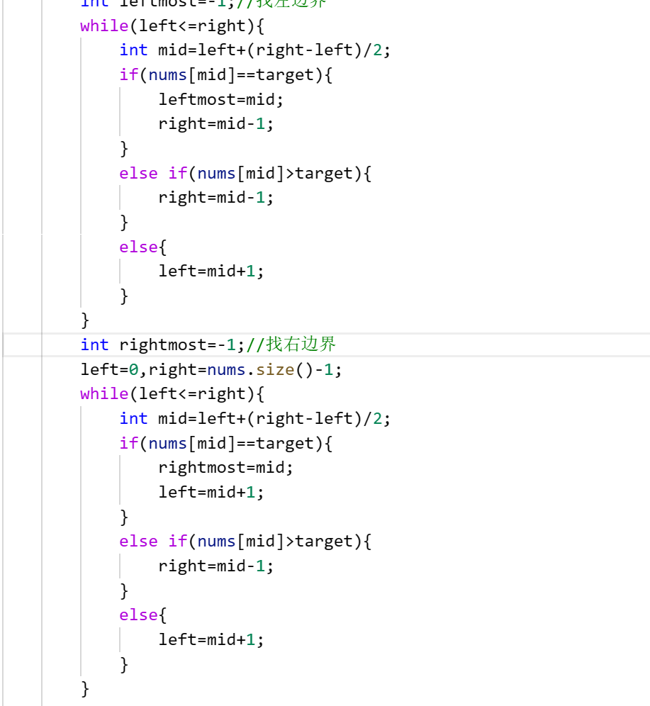

# 力扣

## 链表

1. [23. 合并 K 个升序链表](https://leetcode.cn/problems/merge-k-sorted-lists/)分治解法
   
   

2. 头插法的写法
   
   next=cur->next;
   
   cur->next=next->next;
   
   next->next=pre->next;
   
   pre->next=next;

3. 反转链表的写法
   
   next=cur->next;
   
   cur->next=pre;
   
   pre=cur;
   
   cur=next;

4. 分割string
   
   

5. 二分查找找大于等于目标的第一个数

```int
int binarySearch(vector<int>& nums, int target) {
    int left = 0, right = nums.size() - 1;
    while (left <= right) {
        int mid = left + (right - left) / 2;
        if (nums[mid] < target) {
            left = mid + 1;
        }
        if (nums[mid] > target) {
            right = mid - 1;
        }
        if (nums[mid] == target) {
            left = mid + 1;
        }
    }
    if (nums[left - 1] == target) {
        return left - 1;
    }
    return left;
}
```

   6. 二叉树遍历的题目，边界条件只要考虑某一个数组的比如preorder，在前序遍历和后序遍历构造二叉树由于要找到左子树的索引，还需要多考虑一个preStart==preEnd的情况，主要防止数组越界。

7. 归并排序里的temp数组复制只要从left到right即可，全部很容易超时。

8. 归并排序可以得出比一个元素小的数有多少个。

9. 快速排序可以得出第k大或第k小的元素，时间复杂度只要O(n)

10. 图的遍历算法中visited并不能判断环，需要用path辅助才能判断有没环

11. 迪杰斯特拉算法需要注意题目究竟需要的是大根堆还小根堆（既优先队列的正序逆序），构造图的时候如果是无向图应该双向构造。

12. 递归dp函数尽量传引用而不是传值
    
    

13. 注意如果不是拓扑图的话是不能用DP的。
    
    

14. 备忘录数组可以用unordered_map实现，但是这比二维的vector更慢有可能过不了测试。

15. 如果用dp数组要考虑dp数组的求解顺序，两人比赛类型的题目（博弈问题）参考[经典动态规划：博弈问题 | labuladong 的算法小抄 (gitee.io)](https://labuladong.gitee.io/algo/di-er-zhan-a01c6/yong-dong--63ceb/jing-dian--467d1/)dp含义设计很巧妙。

16. dp里的股票那一文写的dp数组的设计很好。

17. 贪心算法设计区间问题考虑对区间首或尾排序再贪心。

18. 力扣698回溯想剪枝时，由于需要考虑保存的visited整个数组作为memo，可以把visited压缩状态变成int。注意这种时候要看题目给的数组长度为多少，如果数组太长是不能变成int的比如[416. 分割等和子集 - 力扣（LeetCode）](https://leetcode.cn/problems/partition-equal-subset-sum/comments/)这题，我用回溯超时，需要剪枝，但如果用visited变成int来存发现数组长度已经超过了32位。
    
    
    
    但是可以把visited数组变成字符串
    
    

19. 回溯类的题目可以设一个start防止出现顺序不同但其实是一类比如[2,3,4]和[3,2,4]这种。

20. 回溯子集/组合里出现[10,1,2,7,6,1,5],target=8这种重复但不可复用的元素只需先排序一下再剪枝即可（判断当前元素是否和之前元素相同）。不会出现[1,7]和[7,1]。不需要visited数组

21. 回溯的排列问题都需要visited数组，出现重复但不可复用的元素排序一下再剪枝即可（判断当前元素是否和之前元素相同还要加上之前的元素未使用过）。

22. 回溯法想找到答案后就退出要设置成bool
    
    

23. 用一个for循环i=0到i<9遍历一个九宫格，写法为board[i/3][i%3]

24. 单调队列一般需要队首和队尾都弹出元素然后从队尾压入元素，可以考虑存放元素的索引。

25. 初始化索引数组并根据值数组排序
    
    

26. 差分数组一般复杂度极高，可以利用对区间端点加减，再求前缀和的思路减少复杂度如2023041901。

27. 二分法可以查看[二分查找的实际运用 (xiaoe-tech.com)](https://appktavsiei5995.pc.xiaoe-tech.com/p/t_pc/course_pc_detail/image_text/i_627cce2de4b01a4851fe0ed1)例题三真的很巧妙。运用逆向思维，把最小的和作为搜索。

28. 回溯法，然后动态规划（背包问题），逆向思维，其实一般加备忘录的回溯法和动态规划是一个意思，除非动态规划改变了dp数组的定义减少了复杂度，比如回溯法变成了背包01问题，复杂度大大降低。

29. 递归调试
    
    

30. 像[846. 一手顺子 - 力扣（LeetCode）](https://leetcode.cn/problems/hand-of-straights/)和[659. 分割数组为连续子序列 - 力扣（LeetCode）](https://leetcode.cn/problems/split-array-into-consecutive-subsequences/)这种其实也是回溯法的思想站在每个数的角度看要做什么，但是因为情况太简单比如连续的3个数就满足要求所以不用回溯法，用哈希表即可实现。可以参考
    
    [谁能想到，斗地主也能玩出算法 | labuladong 的算法小抄](https://labuladong.github.io/algo/di-san-zha-24031/jing-dian--a94a0/shui-neng--8a286/)

 31. 涉及表达式计算的注意区分分治法(divide)和表达式求值(simluate文件下的calculate)。

32. 涉及括号插入匹配的问题用need记录需要的右括号数量，用res记录需要的插入操作。只要搞清楚什么时候需要插入即可。

33. 涉及可以到达相同的位置，但是除了位置外该点的代价速度或者什么不同，这种情况视作到达不同的点。可以用map来记录而不要用原来的vis数组了。参考[题目详情 - 2023.05.17-春招-第三题-跑步 - CodeFun2000](https://codefun2000.com/p/P1295)但如果是统计到达终点且要经过所有格子的不同方案则不可以这样记录。

34. 二叉树递归既可以用一个外部变量记录结果，同时递归也可以有返回值，在后序遍历进行处理，参考[124. 二叉树中的最大路径和 - 力扣（LeetCode）](https://leetcode.cn/problems/binary-tree-maximum-path-sum/description/)。

35. 先考虑使用优先队列再考虑set即使这样要一个临时队列来存放遍历过程。（遍历完再push回优先队列）

36. 分解成子问题发现不对时，直接暴力枚举每个点。

37. 不知道为什么下面第一种写法更快。
    
    第一种：
    
    ```cpp
    int dx[4] = {1,0,-1,0};
    
    int dy[4] = {0,1,0,-1};
    ```
    
    第二种：
    
    ```
    vector<vector<int>> dirs = {{-1, 0}, {0, 1}, {1, 0}, {0, -1}};
    ```

38. 二分法和DFS结合的使用可以参考力扣6951。（以及多源BFS）

## 动态规划

1. 涉及dp[i][j]=dp[i+1][j-1]这种状态转移，枚举时可以用长度来枚举（肯定是先把所有短的序列求出来再求长的）。第一次循环为长度，第二层循环为初始点i，然后计算j（如果超出边界就舍去）参考力扣5.最长回文子串
   
   

2. 字符串匹配问题的动归状态可以设置为true和false；

3. dp[i][j]可以表示长度为i的字符串且以字符下标j结尾。

4. 当动态规划涉及到越界问题时可以把数组声明大一点然后不初始化。比如dp直接前面多声明两个空间。
   
   
   
   再比如
   
   
   
   不然得像下面这种初始化但上面这种方法时间和空间都会慢很多很奇怪
   
   

## 二分搜索

1. 不管是找小于target的第一个数，还是找target出现的左边界或者啥的都用闭区间写法，然后用一个临时变量来记录想要的值。下面是力扣34题。
   
   

2. 遇到最小化最大值和最大化最小值问题用二分搜索，如果具有单调性则用贪心（考虑从后向前遍历），如果类似抢劫问题用dp。
   
   

## BFS

1. 求最小到达的步数除了动态规划也可能是BFS参考力扣1654
   
   

## 前缀和

+ 一维前缀和

```
preSum.resize(nums.size() + 1);
            // 计算 nums 的累加和
            for (int i = 1; i < preSum.size(); i++) {
                preSum[i] = preSum[i - 1] + nums[i - 1];
            }
```

+ 二维前缀和

```cpp
preSum[i][j] 记录 matrix 中子矩阵 [0, 0, i-1, j-1] 的元素和
```

```
// 计算每个矩阵 [0, 0, i-1, j-1] 的元素和
for (int i = 1; i <= m; i++) {
    for (int j = 1; j <= n; j++) {
        preSum[i][j] = preSum[i-1][j] + preSum[i][j-1] + matrix[i - 1][j - 1] - preSum[i-1][j-1];
    }
 }
// 计算子矩阵 [x1, y1, x2, y2] 的元素和包含了x1,y1这个点所以减去的不该包含x1,y1这个点而应该是[0,0,x1-1,y2]和[0,0,x2,y1-1]
int sumRegion(int x1, int y1, int x2, int y2) {
    return preSum[x2+1][y2+1] - preSum[x1][y2+1] - preSum[x2+1][y1] + preSum[x1][y1];
}
```

## 差分数组

```cpp
int diff[max_end+2];
memset(diff,0,sizeof(diff));
for(auto& x:nums){
    diff[x[0]]+=1;
    diff[x[1]+1]-=1;
}
int res[diff.size()];
// 根据差分数组构造结果数组
res[0] = diff[0];
for (int i = 1; i < diff.size(); i++) {
    res[i] = res[i - 1] + diff[i];
}
```

## 快速幂

```cpp
 // 计算10的b次幂
 a=10;
 while(b) // 快速幂
    {
        if(b&1) res = res * a % mod;
        a = a * a % mod;
        b >>= 1;
    }
```

## 图

```cpp
// 力扣2603 删除一个无向图的叶子节点其实就是拓扑排序BFS无向图写法改版
queue<int>q;
        for(int i=0;i<n;i++){
            if(degree[i]==1){
                q.push(i);
            }
        }
        while(!q.empty()){
            int front=q.front();
            degree[front]--;
            q.pop();
            for(int neighbor:graph[front]){
                degree[neighbor]--;
                // 还可以继续删删完后出现的叶子节点
                /*if(degree[neighbor]==1){
                    q.push(neighbor);
                }*/
            }
        }
```
