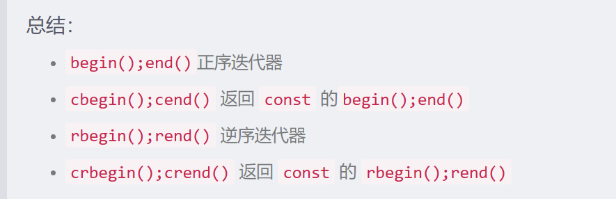
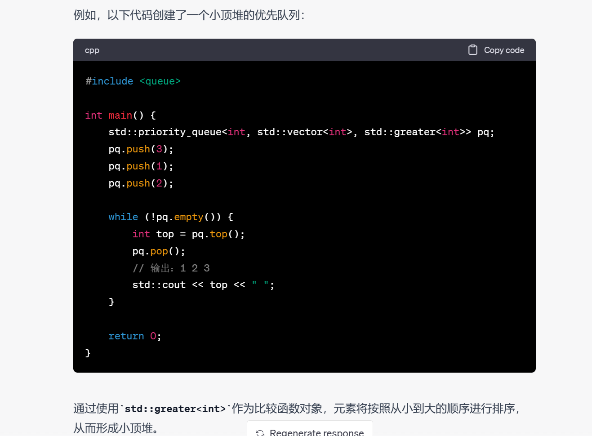
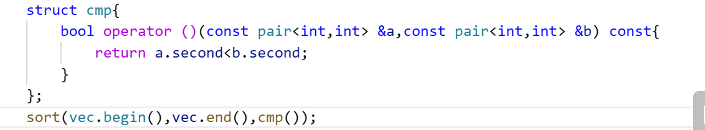
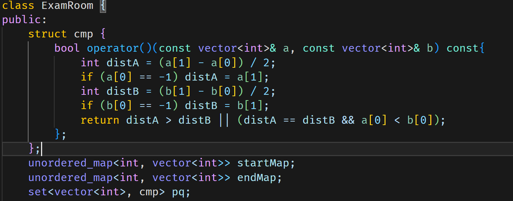
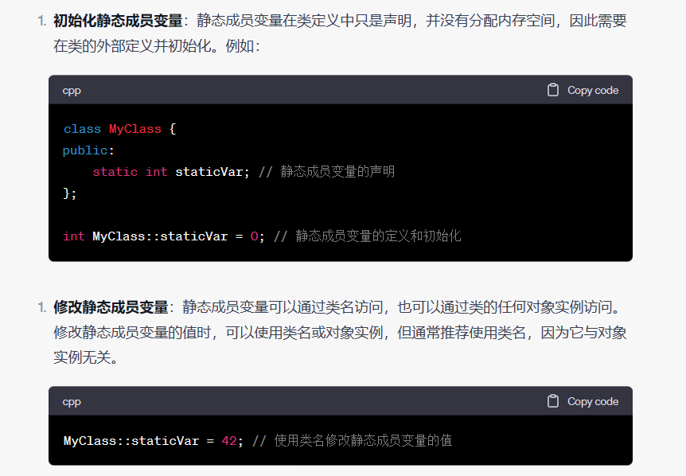

## 各种容器的插入方法

在 C++ 标准库中，有多种容器类型可供选择，其中一些支持 `push_back()`，一些支持 `emplace()`，一些支持 `emplace_back()`。

使用emplace_back() 函数可以减少一次拷贝或移动构造的过程，提升容器插入数据的效率。由于 emplace_back() 是 C++ 11 标准新增加的，下面是它们的简要介绍及其区别：

1. `std::vector`
- `push_back()`：将一个元素添加到容器的末尾
- `emplace_back()`：将元素构造在容器的末尾

`push_back()` 和 `emplace_back()` 都用于向容器添加元素，但它们的区别在于 `emplace_back()` 是在容器中直接构造元素，而 `push_back()` 是先构造元素，然后将其复制或移动到容器中。使用 `emplace_back()` 通常可以更高效地构造元素，因为它避免了额外的复制或移动操作。

2. `std::list`
- `push_back()`：将一个元素添加到容器的末尾
- `emplace_back()`：也可以用
+ 删除元素remove删除指定值的元素，erase删除指定迭代器的元素
+ splice可以在指定的迭代器位置处添加元素
3. `std::deque`
- `push_back()`：将一个元素添加到容器的末尾，先构造一个临时的再用移动构造移动
- `emplace_back()`：将元素构造在容器的末尾

`deque` 容器与 `vector` 类似，但它支持更快的插入和删除操作。`emplace_back()` 可以像 `vector` 一样使用，而 `push_back()` 的行为与 `vector` 相同。

4. `std::set` 和 `std::map`
- `insert()`：将一个元素或键值对添加到容器中
- `emplace()`：将元素或键值对构造在容器中

`set` 和 `map` 容器是关联容器，它们不支持 `push_back()` 和 `emplace_back()`。相反，它们使用 `insert()` 和 `emplace()` 方法来添加元素或键值对。

总的来说，这些方法的主要区别在于它们如何构造和添加元素，以及它们在内存管理方面的效率。因此，在选择使用哪个方法时，需要根据容器类型和具体应用场景来确定。

5. unordered_map可以用count(key)来判断元素存不存在，如果存在返回1，否则返回0。但如果是复杂类型需要重载作为key的类型的==。
6. 迭代器



可以把迭代器作为unordered_map的second使用这样可以实现在链表中删除元素达到O(1数量级)，list的迭代器就是指针。

7. 字符串

比如fmt::format("agg#{}", term_idx)，使用了`fmt::format`函数创建了一个字符串，格式为`"agg#{}"`，其中`{}`表示一个占位符，被`term_idx`的值所替代。这样就创建了一个形如`"agg#0"`、`"agg#1"`、`"agg#2"`等的字符串

8. 删除
   
   std::vector这种必须要通过位置来删除，没办法通过值去删除，可以先用std::find找到对应值的迭代器位置。当然用std::remove(iter1,iter2,值)可以替代上面这种方法。
   
   std::set,std::unordered_map这种可以直接通过erase来删除对应值。
   
   std::list删除元素remove删除指定值的元素，erase删除指定迭代器的元素

9. 优先队列
   
   
   
   C++的优先队列默认大顶堆，既元素从大到小排序，这里写的greater是a>b为小顶堆，所以输出为1 2 3.可以参考我的test.cpp里的代码。反正top和比较函数是反着来的。

10. 对一个二维vector全部赋值为0
    
    vector<vector> preSum;
    
    preSum = vector<vector<int>>(m + 1, vector<int>(n + 1));

11. 注意CLion如果函数没写返回值是不会报错的，也不会运行。

12. char *a="111";这种情况下是字符串字面量是不可以修改的，必须得是char a[10001足够大才可以进行strcat拼接操作。

13. wsl下cd /mnt/d/。

14. 可以把unordered_set变成vector
    
    unordered_set<string> a;
    
    auto b=vector<string>(a.begin(),a.end());

## string

1. 用substr可以截取string，用法为s.substr(start,len)
2. vector<string>好像不能用find
3. to_string(num)可以把num转为string

## vector

1. 用resize来改变vector空间而不是reserve(即使reserve也无法访问到元素)

2. 初始化二维数组全为-1
   
   memo=vector<vector<int>>(100,vector<int>(100,-1));

3. accumulate(vec.begin(),vec.end(),0)用于求数组和。

4. pair排序写法
   
   

## map/set

1. map可以定义根据key的各种排序方式 map<int,int,cmp()>,这里的cmp好像不能用匿名函数代替，但sort里的可以，但是无法定义根据value的排序方式。sort无法对这些关联容器排序

2. 比较函数后面的const非常重要不加会报错
   
   

## 类

1. 类中的静态成员变量要在类外进行定义，类里面只是声明了这个静态变量而已
   
   

2. 写类的时候记得写默认构造函数不然经常会有问题

## 迭代器

1. lower_bound求的是大于等于某元素

2. upper_bound求的是大于某元素二分法查找大于target的第一个元素位置
   
   ```cpp
   int j = upper_bound(arr.begin(), arr.end(), target) - arr.begin();
   ```

## deque

1. deque底层实现还是数组，可以随机访问，而且支持双端插入删除

## 单调队列&单调栈

1. 当题目需要从两端都需要push数据时考虑用单调队列，这时候一般都考虑尾部弹出有时候要考虑前面弹出。当题目左端点固定不动时考虑用单调栈，一般考虑尾部弹出栈。

2. 一般全为正的数组是有单调性的如209，但是有正有负的数组没有单调性这时候没法用滑动窗口、双指针方法解决，得用单调队列。如862
