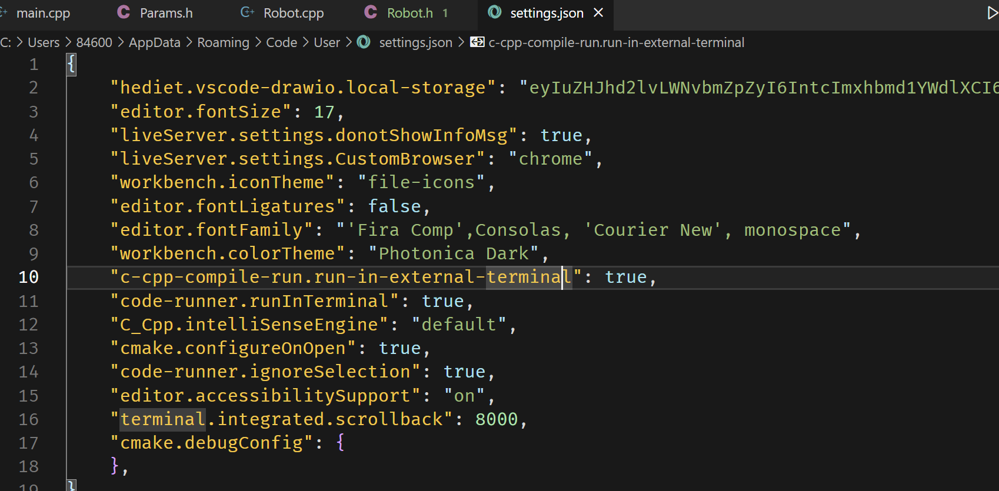

## 如何指定vscode编译器

1. 在windows下点击左下方的搜索kit

2. 在输出中看见搜索的添加文件


3. 根据该路径找到json文件进行手动添加

## 如何修改cmake的cache


## VScode无法跳转

1. ctrl+shift+P然后输入user，将C_Cpp.intelliSci..这一项设置为default。



## VScode在终端显示分支

1. code  ~/.bashrc

2. 在打开的文件最下面加入

```function
# git branch
function git_branch {
  branch="`git branch 2>/dev/null | grep "^\*" | sed -e "s/^\*\ //"`"
  if [ "${branch}" != "" ];then
      if [ "${branch}" = "(no branch)" ];then
          branch="(`git rev-parse --short HEAD`...)"
      fi
      echo " ($branch)"
  fi
}

# 终端显示路径
export PS1='\u@\[\033[01;36m\]\w\[\033[01;32m\]$(git_branch)\[\033[00m\]\$ '
```

3. 然后在终端输入source ~/.bashrc

## gitlab连接不上

1. 由于之前连接过gitlab（但现在域名或者端口变了），需要删除cd ~/.ssh目录下的known_host等一系列文件

## 刷力扣环境配置

从[GroverZhu/Data-Structures-and-Algorithm: Data Structures and Algorithm (github.com)](https://github.com/GroverZhu/Data-Structures-and-Algorithm)克隆下来执行下面

```sudo
sudo build_support/packages.sh
cmake ..
```

下载clangd扩展然后执行

```
sudo apt install clangd
```
